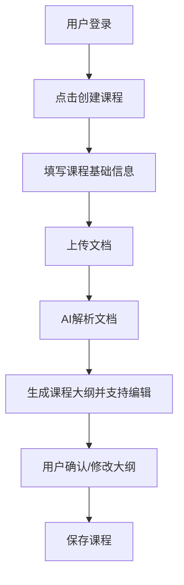
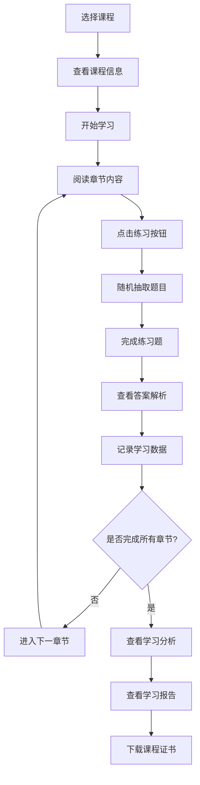
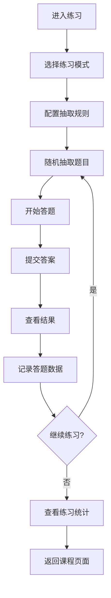
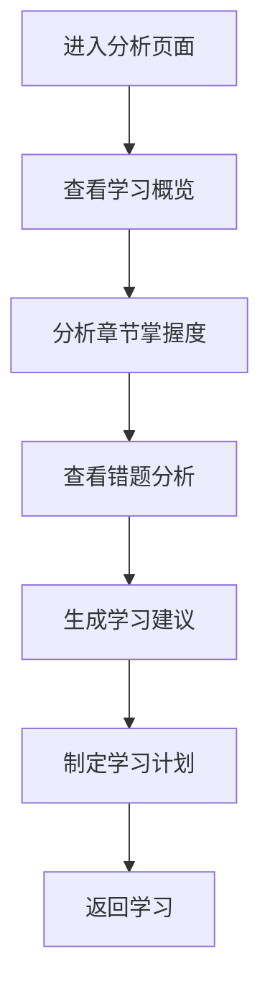
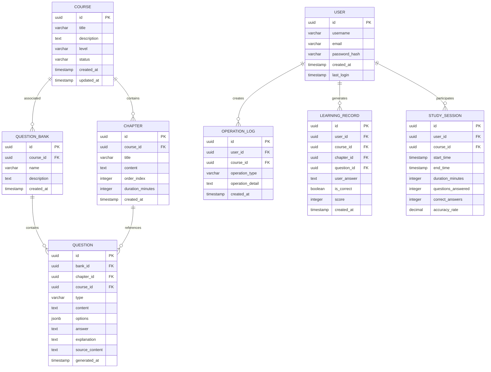
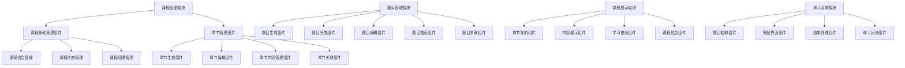

# 智能交互式课程创建工具 - 产品需求文档 (PRD)

## 1. 产品概述

### 1.1 产品定位
智能交互式课程创建工具是一个基于AI技术的在线教育平台，能够将用户上传的文本材料自动转换为结构化的交互式网络课程，大幅提升课程制作效率并增强学习体验。

### 1.2 目标用户
- 教育工作者（教师、培训师）
- 在线教育内容创作者
- 企业内训人员
- 个人知识分享者

## 2. 功能设计

### 2.1 核心功能模块

#### 2.1.1 课程管理模块
**功能描述**：课程的全生命周期管理，包括章节管理

**主要功能**：
- 课程基础信息管理
- 课程状态管理（草稿、发布、归档）
- 课程CRUD操作（创建、读取、更新、删除）
- 章节管理（作为课程管理的子功能）

**课程CRUD操作**：
- **创建课程**：新建课程、填写基础信息、上传文档
- **查看课程**：课程列表、课程详情、搜索筛选
- **编辑课程**：修改课程信息、更新内容、重新生成
- **删除课程**：删除确认、批量删除、回收站管理

**数据记录功能**：
- **操作日志**：记录所有课程相关操作（创建、编辑、删除、发布）
- **学习轨迹**：记录用户学习行为（学习时长、练习次数、答题记录）
- **版本管理**：记录课程内容修改历史和版本对比
- **数据统计**：课程访问量、学习完成率、用户反馈统计

**章节管理子功能**：
- 章节生成（AI自动生成章节结构，流式输出前端渲染）
- 章节编辑（内容编辑、排序、删除）
- 章节内容管理（文本、多媒体内容）
- 章节关联管理（与题库题目的关联）

**输入要求**：
- 支持PDF、TXT格式文档
- 文档大小限制：≤50MB
- 文档语言：中文优先

#### 2.1.2 题库管理模块
**功能描述**：基于课程文档内容的题库系统管理，与课程关联但不直接属于课程

**主要功能**：
- 题目生成（基于课程文档内容AI自动生成各类题目）
- 题目分类（按课程、难度、类型分类）
- 题目编辑（内容编辑、答案管理）
- 题目搜索（题库搜索、筛选功能）

**题目生成流程**：
- 基于课程文档内容分析
- 根据章节内容生成对应题目
- 支持按章节、按难度、按类型生成
- 题目与源文档内容保持一致性

**练习类型**：
- 单选题
- 多选题
- 判断题
- 填空题
- 简答题（可选）

**题目结构**：
- 题干内容
- 选项列表（如适用）
- 正确答案
- 详细解析

#### 2.1.3 课程展示模块
**功能描述**：展示完整的课程

**主要功能**：
- 章节导航
- 课程播放
- 课程章节

#### 2.1.4 练习系统模块
**功能描述**：从题库中抽取题目进行练习，提供完整的练习体验

**主要功能**：
- 练习入口（课程页面练习按钮、题库列表）
- 随机题目抽取（按规则随机抽取题目）
- 答题界面（题目展示、答题交互）
- 结果处理（答案验证、分数计算）
- 练习记录（答题历史、错题记录）

**练习入口设计**：
- **课程练习按钮**：在课程详情页面提供"开始练习"按钮
- **题库练习入口**：从题库管理页面进入练习
- **快速练习**：支持按章节、按难度快速开始练习

**随机抽取机制**：
- **抽取规则**：每个章节随机抽取2-3道题目
- **抽取策略**：按题目类型均衡分配（单选、多选、判断、填空）
- **难度分布**：根据课程级别自动调整难度比例
- **抽取配置**：支持自定义抽取数量和类型比例

**练习模式**：
- **章节练习**：针对特定章节进行练习
- **综合练习**：从所有章节随机抽取题目
- **错题练习**：专门练习历史错题
- **模拟考试**：按考试模式进行完整练习

### 2.2 进阶功能模块

#### 2.2.1 学习分析模块
**功能描述**：基于题库答题数据的学习分析，提供详细的学习报告和可视化展示

**主要功能**：
- 学习数据统计（答题分数、学习时长、练习次数）
- 章节掌握度分析（各章节掌握程度可视化）
- 薄弱环节识别（知识点薄弱点分析）
- 学习进度跟踪（整体学习进度展示）
- 个性化学习建议（基于分析结果的学习计划）

**分析页面设计**：
- **学习概览**：总体学习数据展示（总练习次数、平均分数、学习时长）
- **章节分析**：各章节掌握度雷达图、正确率柱状图
- **题型分析**：不同题型答题情况对比分析
- **时间分析**：学习时间分布、学习效率趋势
- **错题分析**：错题知识点分布、常见错误类型统计

**数据可视化**：
- **进度条**：整体学习进度、各章节完成度
- **图表展示**：柱状图、饼图、折线图、雷达图
- **趋势分析**：学习效果随时间变化趋势
- **对比分析**：不同时期学习效果对比

**学习建议生成**：
- **重点复习**：基于薄弱环节推荐重点复习内容
- **学习计划**：个性化学习时间安排建议
- **练习推荐**：推荐需要加强练习的题目类型
- **学习目标**：设定阶段性学习目标

## 3. 功能交互设计

### 3.1 用户操作流程

#### 3.1.1 课程创建流程


#### 3.1.2 课程学习流程


#### 3.1.3 练习流程


#### 3.1.4 学习分析流程


### 3.2 界面交互设计

#### 3.2.1 主界面布局
- **顶部导航栏**：Logo、用户信息、设置
- **左侧菜单**：课程列表、创建课程、我的学习
- **主内容区**：课程展示、学习界面
- **底部状态栏**：学习进度、系统状态

#### 3.2.2 课程管理界面
- **课程列表**：课程卡片展示、搜索筛选、排序功能
- **课程详情**：课程信息展示、章节列表、操作按钮
- **课程编辑**：表单编辑、内容修改、保存确认
- **批量操作**：多选课程、批量删除、批量发布

#### 3.2.3 课程创建界面
- **步骤指示器**：显示当前创建步骤（基础信息、上传文档、生成大纲）
- **表单区域**：课程信息输入
- **文件上传区**：拖拽上传文档，上传成功后自动解析
- **大纲编辑区**：显示AI生成的课程大纲，支持编辑章节内容
- **操作按钮**：保存课程、修改大纲、重新生成

#### 3.2.4 课程学习界面
- **课程信息栏**：标题、进度、时长
- **章节导航**：侧边栏章节列表
- **内容展示区**：章节内容、练习题
- **进度条**：学习进度可视化
- **控制按钮**：播放、暂停、下载
- **练习按钮**：开始练习、查看分析

#### 3.2.5 练习界面
- **练习配置区**：选择练习模式、设置抽取规则
- **题目展示区**：题目内容、选项、答题区域
- **进度指示器**：当前题目进度、剩余时间
- **操作按钮**：上一题、下一题、提交答案、暂停练习
- **答题统计**：已答题数、正确率、用时统计

#### 3.2.6 学习分析界面
- **数据概览区**：总体学习数据、关键指标展示
- **图表展示区**：各种数据可视化图表
- **分析详情区**：详细分析结果、学习建议
- **操作按钮**：刷新数据、导出报告、设置目标
- **导航菜单**：不同分析维度的切换

### 3.3 交互细节设计

#### 3.3.1 课程管理交互
- **课程列表交互**：卡片悬停效果、快速预览、批量选择
- **课程编辑交互**：实时保存、修改提示、版本对比
- **课程删除交互**：删除确认弹窗、批量删除、回收站恢复
- **课程搜索交互**：实时搜索、筛选条件、排序选项

#### 3.3.2 文档上传交互
- **拖拽上传**：支持拖拽文件到上传区域
- **点击上传**：点击按钮选择文件
- **进度显示**：上传进度条和状态提示
- **格式验证**：实时检查文件格式和大小
- **预览功能**：上传后显示文档预览

#### 3.3.3 AI生成交互
- **文档分析状态**：显示AI分析文档内容的进度
- **大纲生成状态**：显示课程大纲生成进度
- **大纲编辑功能**：允许用户修改AI生成的课程大纲
- **实时预览**：编辑时实时预览章节内容
- **重新生成**：支持基于文档重新生成课程大纲
- **保存课程**：确认大纲后保存完整课程

#### 3.3.4 练习答题交互
- **题目展示**：清晰的题目布局
- **选项交互**：单选/多选按钮
- **答题反馈**：即时显示正确/错误
- **解析展示**：详细答案解释
- **进度保存**：自动保存答题进度

#### 3.3.5 练习系统交互
- **练习入口交互**：课程页面练习按钮、快速开始练习
- **抽取配置交互**：拖拽调整抽取规则、实时预览抽取结果
- **答题过程交互**：题目切换动画、答题状态提示
- **结果展示交互**：分数动画效果、错题高亮显示
- **练习记录交互**：历史记录查看、错题重做

#### 3.3.6 学习分析交互
- **数据刷新交互**：实时数据更新、加载状态提示
- **图表交互**：图表缩放、数据点悬停、维度切换
- **分析导航交互**：标签页切换、筛选条件调整
- **报告导出交互**：格式选择、下载进度提示
- **学习建议交互**：建议卡片展示、一键应用建议

### 3.4 响应式设计

#### 3.4.1 桌面端适配
- 最小分辨率：1024×768
- 推荐分辨率：1920×1080
- 布局：三栏式布局（导航+内容+侧边栏）

#### 3.4.2 移动端适配
- 最小分辨率：375×667
- 布局：单栏式布局
- 交互：触摸友好的按钮和手势

### 3.5 错误处理与反馈

#### 3.5.1 错误类型
- **文件格式错误**：提示支持的文件格式
- **文件过大**：提示文件大小限制
- **网络错误**：提示网络连接问题
- **AI生成失败**：提供重试选项

#### 3.5.2 用户反馈
- **成功提示**：操作成功的明确反馈
- **警告提示**：潜在问题的提醒
- **错误提示**：错误原因和解决方案
- **加载提示**：长时间操作的进度提示

## 4. 数据模型设计

### 4.1 核心数据关系
- **课程** ← 一对多 → **章节**（通过course_id外键关联）
- **课程** ← 一对多 → **题库**（通过course_id外键关联）
- **题库** ← 一对多 → **试题**（通过bank_id外键关联）
- **章节** ← 一对多 → **试题**（通过chapter_id外键关联）
- **用户** ← 一对多 → **操作日志**（通过user_id外键关联）
- **用户** ← 一对多 → **学习记录**（通过user_id外键关联）
- **用户** ← 一对多 → **学习会话**（通过user_id外键关联）

### 4.2 数据模型图


### 4.3 模块层级结构


## 5. 技术实现要点

### 5.1 前端技术栈
- **框架**：Vue 3 + TypeScript
- **UI组件**：Element Plus
- **状态管理**：Pinia
- **路由管理**：Vue Router 4
- **构建工具**：Vite
- **文件处理**：FileReader API
- **文档解析**：支持PDF、DOC、DOCX、TXT格式
- **样式**：SCSS + CSS Variables
- **图标**：FontAwesome + Element Plus Icons
- **AI服务**：Kimi API (Moonshot AI)
- **数据存储**：LocalStorage

### 5.2 架构特点
- **架构模式**：纯前端实现
- **AI集成**：Kimi API (Moonshot AI)
- **数据存储**：LocalStorage本地存储
- **文档解析**：前端直接处理PDF、DOC、DOCX、TXT格式
- **响应式设计**：支持桌面端和移动端
- **品牌化UI**：专业的智课方舟品牌设计系统

### 5.3 开发环境配置
- **运行环境**：Node.js 18+ (推荐 Node.js 22)
- **包管理器**：npm 或 yarn
- **开发工具**：Vite + Vue 3 + TypeScript
- **代码检查**：ESLint
- **环境变量**：Vite环境变量配置
- **API配置**：Kimi API密钥配置

### 5.4 性能要求
- **页面加载时间**：≤3秒
- **文件上传速度**：≥1MB/s
- **AI生成响应**：≤30秒
- **文档大小限制**：≤50MB
- **浏览器支持**：Chrome 88+, Firefox 85+, Safari 14+, Edge 88+
- **响应式设计**：支持桌面端和移动端

### 5.5 项目结构
```
src/
├── assets/                 # 静态资源
│   ├── css/
│   │   └── brand.css      # 品牌样式系统
│   └── ...
├── modules/               # 功能模块
│   ├── course/           # 课程管理模块
│   ├── learning/         # 课程学习模块
│   ├── question/         # 题库管理模块
│   ├── practice/         # 练习系统模块
│   └── analytics/        # 学习分析模块
├── shared/               # 共享组件和服务
│   ├── api/             # API服务
│   ├── components/      # 通用组件
│   ├── services/        # 业务服务
│   └── utils/           # 工具函数
├── store/               # 状态管理
├── types/               # 类型定义
└── views/               # 页面组件
```

### 5.6 API配置
项目使用Kimi API进行文档解析和内容生成。需要：
1. 注册Moonshot AI账号
2. 获取API密钥
3. 在环境变量中配置密钥

API支持的功能：
- 文档上传和解析
- 课程大纲生成
- 章节内容生成
- 题目自动生成
- 内容优化和增强

## 6. 验收标准

### 6.1 功能验收
- [ ] 支持PDF、DOC、DOCX、TXT文档上传
- [ ] 能够生成完整的课程结构
- [ ] 基于课程文档内容生成多种题型
- [ ] 题目与源文档内容保持一致
- [ ] 提供课程播放和下载功能
- [ ] 支持学习进度跟踪
- [ ] 课程CRUD操作完整（创建、查看、编辑、删除）
- [ ] 章节管理功能完整
- [ ] 题库管理功能完整
- [ ] 练习系统功能完整
- [ ] 练习按钮和随机抽取机制正常
- [ ] 学习分析页面功能完整
- [ ] 数据记录功能完整（操作日志、学习轨迹）
- [ ] 用户操作流程完整（创建→学习→练习→分析）

### 6.2 交互验收
- [ ] 界面响应流畅，无卡顿
- [ ] 操作反馈及时准确
- [ ] 错误处理完善
- [ ] 移动端适配良好
- [ ] 用户体验友好
- [ ] 章节编辑交互流畅
- [ ] 题库管理交互便捷
- [ ] 练习系统交互便捷（练习按钮、抽取配置、答题过程）
- [ ] 学习分析交互友好（图表交互、数据展示、建议应用）

### 6.3 性能验收
- [ ] 页面加载时间符合要求
- [ ] 文件处理速度达标
- [ ] 系统稳定性良好
- [ ] AI生成响应时间达标
- [ ] Vue3应用性能优化到位
- [ ] 浏览器兼容性良好
- [ ] 移动端适配良好
- [ ] LocalStorage数据存储稳定
